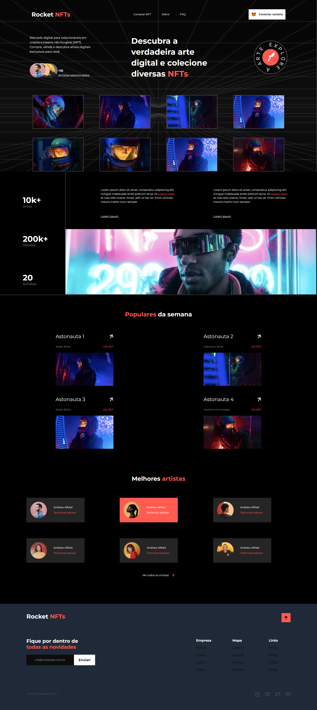

## 💻 About the Project

This project show a landing page about NFTs where the user can buy, sell and collect NFTs. 

## 🧭 Tecnologies

This project was developed using:
- HTML
- CSS
- [Tailwind](https://tailwindcss.com/)


You can check the live site here: https://verdant-taiyaki-5e1563.netlify.app/





<h2>
  📌 To have a copy of the project
</h2>

### Clone the repository to have a copy of the code on your machine

```bash
$ git clone https://github.com/jvictorribeiro/landing-page-NFTs.git && cd landing-page-NFTs
```

<h3 align=center>Made by <a href="https://www.linkedin.com/in/victor-ribeiroo//">Jv</a></h3>
